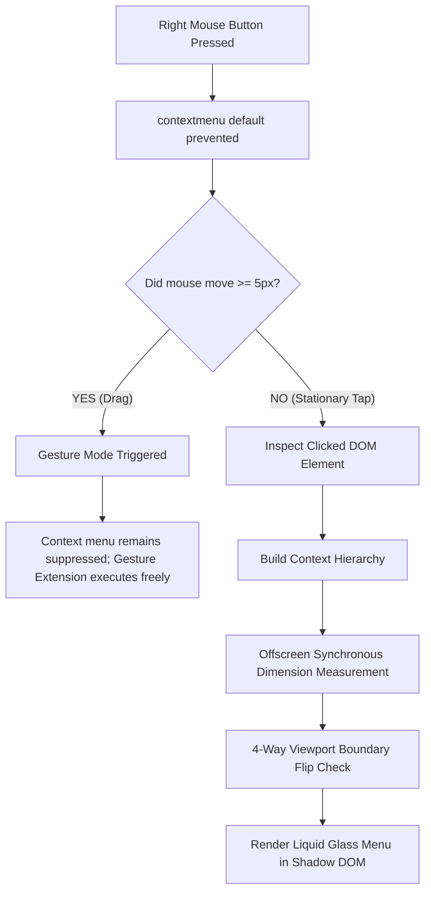

# Native Right-Click for Chromium

<p align="center">
  
</p>

<p align="center">
  <strong>A blazing fast, liquid-glass context menu that feels 100% native and coexists flawlessly with mouse gesture extensions on macOS & Chromium.</strong>
</p>

<p align="center">
  
  
  
  
</p>

---

## The Backstory: Why I Built This

If you’ve ever tried using mouse gesture extensions on macOS Chromium (Google Chrome, Brave, Edge, Arc), you know the pain:

> **The macOS Chromium Quirk:**  
> On macOS, Chromium fires the `contextmenu` event immediately on `mousedown` (the moment your finger presses down on the right mouse button).  
> If you hold right-click and drag to perform a gesture (like closing a tab, navigating back, or scrolling to the bottom), **a native context menu pops up right over your gesture, stealing focus and ruining the motion**.

Existing workaround extensions were frustrating:
- They felt sluggish and flickered when opening.
- They were cluttered with broken browser buttons that don’t work in extensions (like fake "Inspect Element" or non-functional "Save Page As").
- They looked completely out of place on modern operating systems.
- Their CSS bled into webpages, breaking page layouts.

**Native Right-Click was built to solve this once and for all.**  
It provides a pixel-perfect, liquid-glass context menu that opens instantly on stationary taps, while giving your gesture extension complete, uninterrupted freedom whenever you drag.

---

## What Makes It Different

| Feature | Typical Custom Menu Extensions | Native Right-Click |
| :--- | :--- | :--- |
| **Gesture Coexistence** | Intercepts mouse events or conflicts with gestures | **Gesture-First Engine**: Stationary tap opens menu; mouse drag ($\ge 5\text{px}$) silently yields to your gestures |
| **Visual Design** | Clunky Windows 98 or flat generic CSS | **Liquid Glassmorphism**: Frosted glass blur, subtle specular highlights, dark/light auto adaptation |
| **Positioning & Jump** | Flickers for a split second while recalculating | **Zero-Flicker 4-Way Smart Placement**: Synchronous offscreen measurement with automatic edge flipping |
| **Action Reliability** | Filled with broken browser-restricted options | **100% Functional Actions**: Every single option works reliably |
| **Image Handling** | Basic link copying only | **Direct 1-Click Download**, Save As dialog, and Canvas-based binary Image Copying |
| **Clipboard Pasting** | Plain text only | **Dual Mode**: Pastes text into inputs, and pastes **binary images/screenshots** into chat boxes (Discord, WhatsApp, Slack, GitHub) |
| **Isolated Styles** | Injected directly into webpage DOM (breaks page CSS) | **Encapsulated Shadow DOM**: Never pollutes or gets distorted by page styles |
| **Shortcuts & Icons** | Emoji icons or no visual hints | **Google Material Vector Icons** + native macOS keyboard shortcut hints (`⌘C`, `⌘V`, `⌘R`, `⌘W`, `⌘J`) |

---

## Features & Contexts

Native Right-Click inspects what you clicked on and dynamically serves only relevant, high-utility options:

### 1. Image Context
Right-clicking any image (or image wrapped inside a link) prioritizes image tools first:
- **Open Image in New Tab** *(opens right next to your active tab)*
- **Download Image** *(1-click direct download straight to your Downloads folder without dialogs)*
- **Save Image As...** *(opens system save dialog to choose destination & filename)*
- **Copy Image** *(converts and copies binary PNG data to your system clipboard)*
- **Copy Image Address**
- *If inside a link:* **Open Link in New Tab**, **Open Link in New Window**, **Open Link in Incognito Window**, **Copy Link Address**, **Share Link...**

### 2. Standalone Link Context
Right-clicking any standard link or SVG link icon:
- **Open Link in New Tab** *(placed immediately adjacent to current tab)*
- **Open Link in New Window**
- **Open Link in Incognito Window**
- **Copy Link Address**
- **Share Link...** *(native system share sheet on macOS / fallback copy)*

### 3. Text Selection Context
Right-clicking highlighted text:
- **Copy** (`⌘C`)
- **Search Google for "..."**
- **Ask with AI Mode** *(direct query to Google AI Mode search)*

### 4. Editable Inputs & Chat Boxes
Works across `<input>`, `<textarea>`, `contenteditable`, and web chat textboxes (Discord, WhatsApp Web, Slack, Twitter/X, GitHub, Notion):
- **Cut** (`⌘X` - reactive event trigger)
- **Copy** (`⌘C`)
- **Paste** (`⌘V` - supports both text and **binary image/screenshot pasting**)
- **Paste and Go** *(navigates immediately in the current tab)*
- **Select All** (`⌘A`)

### 5. Open Area / Global Context
Right-clicking anywhere on the page:
- **Back** *(dynamically disabled if no prior history exists via Chromium Navigation API)*
- **Forward** *(dynamically enabled only when forward navigation history exists)*
- **Reload** (`⌘R`)
- **Ask with AI Mode**
- **New Tab** (`⌘T` - opens adjacent to active tab)
- **Close Tab** (`⌘W`)
- **Downloads** (`⌘J` - opens `chrome://downloads` next to current tab)
- **Copy Page URL** (`⌘C`)
- **Share...**
- **Scroll to Top** & **Scroll to Bottom** *(multi-container smart scrolling that detects nested scrollable containers in SPAs)*

---

## Under The Hood: How It Works



### 1. Chromium Event Model on macOS
On macOS Chromium, `contextmenu` fires on `mousedown`. To allow right-click gestures without popup interruption:
1. `contextmenu` captures and prevents default browser popup creation.
2. `mousedown` records the initial `(x, y)` coordinate.
3. `mousemove` computes the Euclidean distance $\Delta = \sqrt{(x - x_0)^2 + (y - y_0)^2}$.
4. If $\Delta \ge 5\text{px}$, `isDragging` is flagged and menu rendering is **aborted**.
5. If released within threshold, the menu renders cleanly on `mouseup`.

### 2. Zero-Flicker Synchronous Positioning
Instead of guessing dimensions with `requestAnimationFrame` (which causes a 1-frame position jump), the menu is measured synchronously at `visibility: hidden; left: -9999px`. Its bounding rectangle is checked against viewport edges (`window.innerWidth`, `window.innerHeight`), automatically flipping upwards or to the left when near screen boundaries, before making itself visible.

### 3. Universal Multi-Container Scrolling
Single Page Applications (SPAs like Twitter, Discord, Reddit, Slack) lock `window` scrolling and place scrollbars on internal `<div style="overflow-y: auto">` containers. Native Right-Click walks up the DOM tree from the click target to identify and scroll the exact container, while also syncing `document.scrollingElement`, `document.documentElement`, and `window`.

---

## Installation & Setup

### Developer Mode (Local Installation)

1. Clone or download this repository:
   ```bash
   git clone https://github.com/<your-username>/quick-right-click.git
   ```
2. Open Google Chrome (or any Chromium browser: Brave, Edge, Arc) and navigate to:
   ```
   chrome://extensions
   ```
3. Enable **Developer mode** toggle in the top-right corner.
4. Click **Load unpacked** and select the `quick-right-click` directory.
5. Right-click anywhere on any webpage to use your new context menu!

---

## Settings & Customization

Click the extension icon in your browser toolbar to open the settings popup:

* **Trigger Activation:**
  * **Stationary Tap** *(Default, Recommended)*: Instant menu on click; smooth dragging for gestures.
  * **Hold / Long Press**: Stationary hold for 250ms before opening.
  * **Double Right-Click**: Opens menu on rapid double-tap.
* **Gesture Drag Sensitivity:** Adjustable slider from `2px` to `16px` to fine-tune your mouse movement tolerance.
* **Glass Theme:** Choose between **System Auto**, **Dark Glass**, or **Light Glass**.
* **Disable Animations:** Toggle instant 0ms menu opening with zero transitions.

---

## Keyboard Accessibility

* <kbd>↓</kbd> / <kbd>↑</kbd> — Navigate up and down through menu items with active focus ring
* <kbd>Enter</kbd> — Execute focused action
* <kbd>Esc</kbd> — Close context menu

---

## License

MIT License. Free and open source for everyone.
